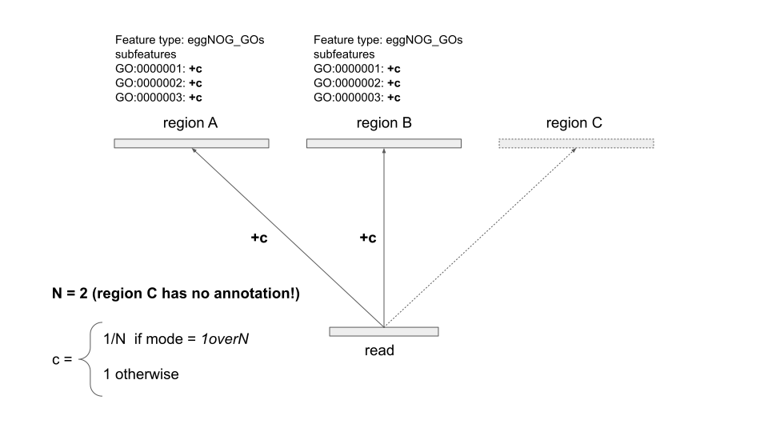
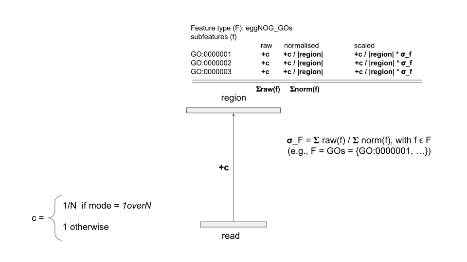

## This is the v1 legacy branch (v.1.5).

### Prerequisites
- Python3.7+ (we need to be able to rely on dictionary item order preservation!)

### Dependencies
Build:
- wheel 

Install (will be automatically installed if pip install is used as described below):
- intervaltree
- numpy
- pandas

### Installation
1. Obtain the source code `git clone https://github.com/cschu/gff_quantifier.git`.
2. `cd gff_quantifier`.
3. `python setup.py bdist_wheel`.
4. `pip install [--user] -U dist/gffquant-<version>-py3-none-any.whl`. The `--user` option is only necessary if you're running this with a shared python version.

After this, the relevant commands `gffindex` and `gffquant` should be in your path.

### Usage
`gffquant` supports two kinds of input data, controlled by the `--mode` or `-m` parameter.

#### The genome mode
Mode `-m genome` is the default mode. The functional profiling strategy in this mode is to only ever have a small portion of the annotation loaded into an interval tree at any given time, thus shifting the memory requirements towards the number of alignments. In `genome` mode, `gffquant` takes as input:
  * a bamfile containing alignments against a set of genomic reference contigs, and 
  * a gff3 file containing functional annotations for the genes encoded on the input contigs. This gff3 must be pre-indexed with `gffindex <input_gff>` in order to allow random access.
    - Pre-indexing will write the index to a file named `<input_gff>.index` and only needs to be done once per gff.
    - For best results, the gff should be strictly sorted by seqname (column 1).
    - The gff must not be gzipped (random access of gzipped files via seek() is not feasible, hence gzipped gffs are not supported).

#### The gene mode
Mode `-m genes` allows large sets of genes to be used as reference. In this mode, `gffquant` takes as input:
  * a bamfile containing alignments against a set of gene sequences, and
  * a gzipped, tab-separated functional annotation file following the GMGC convention (column 1 is the gene id, and the functional categories start in column 7.) 

As all (aligned) reads align against annotated genes, no overlap detection is done in this mode. Thus, the `gene` mode does not require pre-indexing the annotation. However, in order to preserve memory, the bamfile is pre-scanned and information regarding unused reference sequences is discarded (leading to increased runtimes).

#### Running gffquant

Run `gffquant <input_db> <input_bam> -o <out_prefix> [--ambig_mode {[unique_only], all1, primary_only, 1overN}] [--mode {genome, genes}] [--strand_specific]`
  * The `<input_bam>` file needs to be position sorted.
  * Output files are `<out_prefix>.seqname.txt` (contig counts) and `<out_prefix>.feature_counts.txt` (feature/subfeature counts).
  * `--ambig_mode` controls how ambiguously mapping reads are processed. These are analogous to the ngless modes:
      - `'unique_only` will simply ignore any reads that is labeled as ambiguous (`MAPQ=0`). Runtime increases with bamfile size, memory should remain more or less constant.
      - `all1` will treat all ambiguous alignments as single ended individual reads. Runtime increases with bamfile size, memory should remain more or less constant.
      - `primary_only` will only count unique alignments and the primary alignment of a group of ambiguous alignments. Bamfiles that were filtered by `NGLess` will experience decreased counts as it is likely that the primary alignment was removed during filtering.
      - `1overN` will dump all ambiguous alignments to disk (in reduced form), finish the processing of the unique alignments, then read and process the ambiguous alignments. Runtime and memory increase significantly with bamfile size. In addition, temporary disk space proportional to the number of ambiguous alignments is needed. In this mode (and only in this mode), sequence counting will include an additional output with reads distributed to reference contigs according to the `dist1` mode of ngless.

##### RNAseq reads

Single-end RNAseq reads can be processed preserving strandness information via the `--strand_specific` parameter. In this case, the final count tables will contain an additional 6 columns (raw, normalised, scaled for both sense-strand and antisense-strand hits).

	  
### Resource requirements
*(Note: numbers are under revision)*

Memory and computing time requirements correspond to bamfile size. For current bamfile sizes of up to 24GB:
  - `uniq_only` and `all1`: ~10GB memory and ~4h (up to 7h for `all1`)
  - `primary_only`: TBD
  - `1overN`: >10GB memory, ~10min - >8h
  
### Count model 

* Reads aligning uniquely always contribute 1 to the region they align to
* The count contribution of reads with multiple (ambiguous) alignments depends on the mode:
  1. In `unique_only`, ambiguous reads are ignored.
  2. In `all1`, ambiguous reads contribute 1 to each region they align to. Each alignment is treated (and reported) as unique read.
  3. In `primary_only`, all primary alignments contribute 1 to each region they align to. Secondary alignments are discarded.
  4. In `1overN`, each alignment against an annotated region contributes `1/N` to the region. `N` is the number of alignments against an annotated region. Alignments against unannotated regions are ignored.

* Counts against a region are propagated to the subfeatures with which the region is annotated.
* Given feature category `F (e.g. eggNOG_GOs)` with subfeatures `f_1, f_2, f_3, ... (e.g. GO:0000001, ...)`:
  A region with `c` read counts and annotated with `n` subfeatures `(f_1, ..., f_n)` will propagate:
  1. `+c` to each subfeature count `raw(f_i)`
  2. `+c / length(region)` to each normalised subfeature count `norm(f_i)`
* Feature category - specific scaling factors are calculated as `sigma_F = sum(raw(f_i)) / sum(norm(f_i))` for each feature category `F`. These scaling factors are used to restore the proportion of counts with respect to the original sum of counts `scaled(f_i) = norm(f_i) * sigma_F`.
The ngLess documentation states:

> "{scaled} is the result of the {normed} mode scaled up so that the total number of counts is
> identical to the {raw} (within rounding error)"
  
* `gffquant` reports raw counts, normalised, and scaled values together in its count tables

  
  
### Output: count tables

**feature_counts**

Unannotated reads are given in the first non-header row.

Count tables consist of the following columns:
1. `subfeature` (e.g. BRITE:br01600)
2. `uniq_raw`: the raw counts of unique alignments (or, in `all1` mode, the sum of unique and ambiguous alignments)
3. `uniq_lnorm`: the sum of the length-normalised unique raw counts (s. section Count Model)
4. `uniq_scaled`: the scaled, normalised unique counts

If ambiguous reads are not treated as unique (`mode=1overN`), the next 4 columns (5-8; (`combined_`)) additionally contain the sum of contributions from ambiguous alignments **and** unique alignments.

If a strand-specific mode (currently only available for single-end RNAseq reads) was chosen, the table will further continue column blocks for sense-strand counts (`_ss`) and antisense-strand counts (`_as`). 

**seqname.uniq**

columns:

1. reference-id (that's an internal id)
2. contig-id (that's the official "freeze12" id)
3. contig length

Columns 4.,5.,6. are again raw, normalised, and scaled counts. Only unique alignments are counted.

